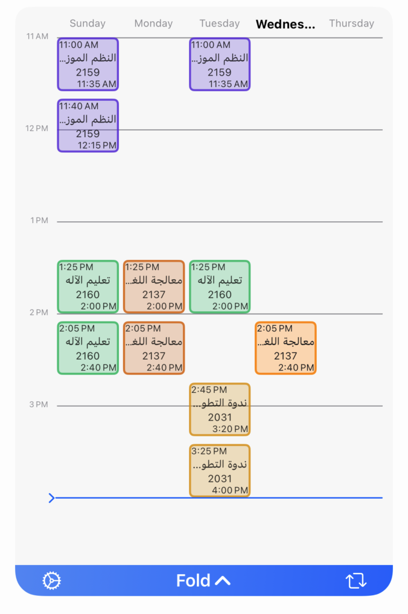
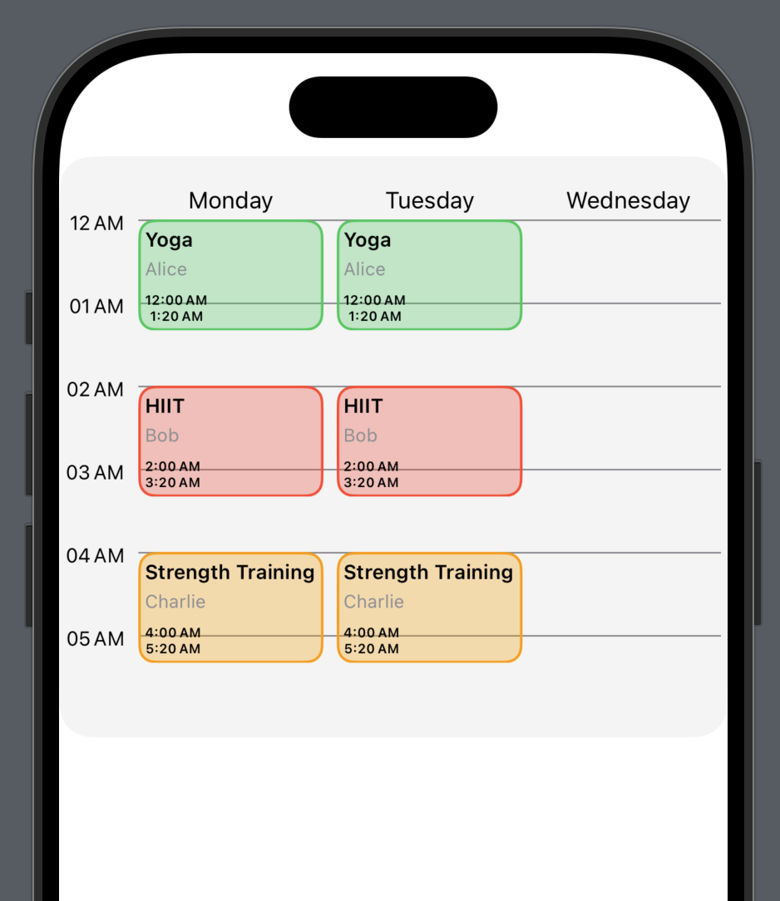

# WeekSchedule

[](https://github.com/SaudAlhafith/WeekScheduleView/releases/latest)
[](https://swiftpackageindex.com/SaudAlhafith/WeekScheduleView)
[](https://swiftpackageindex.com/SaudAlhafith/WeekScheduleView)
[](https://swift.org/package-manager/)


[](https://t.me/SaudAlhafith)

Usage example in a production app
<p align="left">

</p>

**WeekSchedule** is a SwiftUI package designed to help you easily create and manage weekly schedules in your iOS and macOS applications. Whether you're building a calendar app, a task scheduler, or a time management tool, `WeekSchedule` provides a flexible and customizable way to display and interact with weekly timelines.

---

## Features

- **Customizable Weekly View**: Display a week's schedule with customizable day ranges (e.g., weekdays only or full week).
- **Dynamic Timeline Range**: Show only the hours with entries or a full 24-hour timeline.
- **Highlight Today**: Easily highlight today's entries for better visibility.
- **Expandable Entries**: Allow entries to expand for more details.
- **Custom Fonts and Styles**: Customize fonts for days, timeline, titles, subtitles, and time labels.
- **RTL Support**: Fully supports right-to-left languages like Arabic and Hebrew.
- **Flexible Entry Views**: Use custom views for schedule entries or the default `WeekScheduleEntryView`.

---

## Requirements

- iOS 15.0+
- macOS 12.0+

---

## Installation

### Swift Package Manager

To integrate `WeekSchedule` into your project using SwiftPM, add the following to your `Package.swift`:

```swift
dependencies: [
    .package(url: "https://github.com/SaudAlhafith/WeekScheduleView", from: "0.3.0"),
],
```

Or add it directly in Xcode:

1. Go to `File` > `Add Packages...`.
2. Enter the repository URL: `https://github.com/SaudAlhafith/WeekScheduleView`.
3. Select the version you want to use.

---

## Usage

### Basic Example

Here's how to create a simple workout schedule:




```swift
import SwiftUI
import WeekSchedule

struct WorkoutScheduleView: View {
    
    var sessions: [WorkoutSession] = [
        // ...
    ]

    var body: some View {
        VStack {
            WeekScheduleView(entries: sessions) { entry, day, options in
                VStack(alignment: .leading, spacing: 4) {
                    VStack(alignment: .leading, spacing: 2) {
                        Text("\(day.name(style: .wide)) - \(entry.title)")
                            .font(.caption)
                            .bold()
                        if let subtitle = entry.subtitle {
                            Text(subtitle)
                                .font(.caption2)
                                .foregroundColor(.gray)
                        }
                    }
                    VStack {
                        Text(entry.startDate.formatted(.dateTime.hour().minute()))
                            .bold()
                        Text(entry.endDate.formatted(.dateTime.hour().minute()))
                            .bold()
                    }
                    .font(.system(size: 8))
                    .padding(.top, 2)

                }
                .padding(4)
                .frame(maxWidth: .infinity, maxHeight: .infinity, alignment: .leading)
                .overlay(
                    RoundedRectangle(cornerRadius: 10)
                        .stroke(entry.color, lineWidth: 3)
                )
                .background(entry.color.opacity(0.3))
                .cornerRadius(10)
            }
            .scheduleDays(.custom(days: [.monday, .tuesday, .wednesday]))
            .timelineRange(.entriesOnly)
            .timelineIndicator(.red) // New timeline indicator customization
            .background(Color.gray.opacity(0.1), in: .rect(cornerRadius: 20))
            .frame(height: UIScreen.main.bounds.height * 0.4)
            Spacer()
        }
    }
}
```

### Customizing the Schedule

You can customize the schedule using the provided modifiers:

```swift
WeekScheduleView(entries: entries)
    .scheduleDays(.fullWeek, daySpacing: 10, dayFont: .headline) // Show full week with spacing and font customization
    .timelineRange(.fullDay) // Show 24-hour timeline
    .timeline(.gray, font: .caption) // Customize timeline appearance
    .timelineIndicator(.red) // Change timeline indicator color
    .entryHeight(50, 100) // Set normal and expanded entry height
    .isEntryExpanded(true) // Expand entries
    .isEntryTimeShowing(true) // Show entry times
```

---

## Custom Entry Views

You can provide custom views for schedule entries using the `entryViewBuilder` closure:

```swift
WeekScheduleView(entries: entries) { entry, day, options in
    HStack {
        Text("\(day.name(style: .wide)) - \(entry.title)")
            .font(options.dayFont)
        Spacer()
        Text(entry.subtitle)
            .font(options.currentDayFont)
    }
    .padding()
    .background(Color.green.opacity(0.2))
    .cornerRadius(8)
}
```

---

## Supporting Right-to-Left Languages

`WeekSchedule` fully supports right-to-left (RTL) languages. Simply set the environment's layout direction:

```swift
WeekScheduleView(entries: entries)
    .environment(\.layoutDirection, .rightToLeft)
```

---

## Communication

- If you **found a bug**, open an issue or submit a fix via a pull request.
- If you **have a feature request**, open an issue or submit an implementation via a pull request.
- If you **want to contribute**, submit a pull request onto the `main` branch.

---

## License

`WeekSchedule` is released under the MIT license. See the [LICENSE](LICENSE) file for more details.
